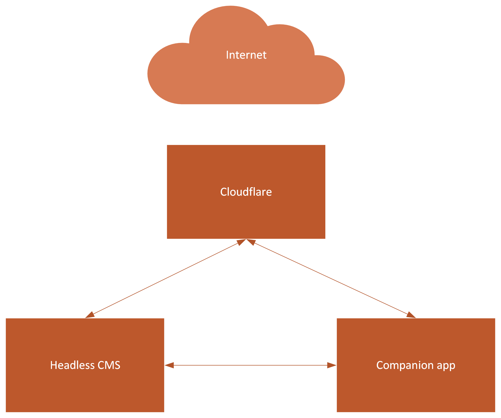

# Optimizely CMS 12 JAMStack Demo - By Jon D Jones 💥

Uses NextJs, Netlify, Cloudflare Pages and a Cloudflare Worker.  Built using a free template from [HTMLUp](https://html5up.net/).

## Cloudflare Pages Hosted Version 👻

Within Cloudflare, you need to set this environment variable.  Set `NODE_VERSION` with `12.22.0`.  Cloudflare uses `_redirects` and `_headers`

**Website**: [https://jamstack.jondjones.com/](https://jamstack.jondjones.com/)

**Web Hook**: [https://api.cloudflare.com/client/v4/pages/webhooks/deploy_hooks/aff1d512-5404-4b0a-97e5-4bcbfc5e04e1](https://api.cloudflare.com/client/v4/pages/webhooks/deploy_hooks/aff1d512-5404-4b0a-97e5-4bcbfc5e04e1)

## Netlify Hosted Version 🕶

Netlify uses `netlify.toml` to configure the site.  

Within netlify, you need to set this environment variable.  Add `CI` ENV var with value `false`

**Website**: [https://cms12-jamstack.netlify.app](https://cms12-jamstack.netlify.app/)

## Optimizely 12 Content CMS 💻

**CMS 12 Starter Kit**: [https://github.com/jondjones/JonDJones.OptimizelyCMS.V12.StarterKit](https://github.com/jondjones/JonDJones.OptimizelyCMS.V12.StarterKit)

**CMS URL**: [http://cms12.jondjones.com/](http://cms12.jondjones.com/)

## Architecture 😍

## Useful Links ⚡️ 

- [Redirects](https://developers.cloudflare.com/pages/platform/redirects)

- [Build Configuration](https://developers.cloudflare.com/pages/platform/build-configuration)